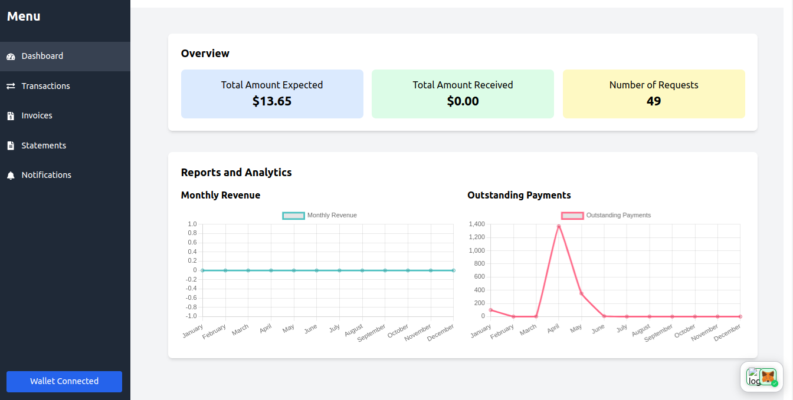

<div align="center">
<h1>request-accounting</h1>
</div>




## Running Locally

1. **Clone Repo**

   ```bash
   git clone https://github.com/thopatevijay/request-accounting.git
   ```

2. **Install Dependencies**

   ```bash
   npm i
   ```

3. **Run App**
   ```bash
   npm run dev
   ```

## Technical Stack

- **Frontend**: Next.js
- **Backend**: Requests Network SDK
- **Styling**: Tailwind CSS

## Request Accounting

The Decentralized Accounting and Financial Management App is a robust, blockchain-based platform designed to streamline and enhance financial management and accounting processes. By leveraging the Request Network, the app facilitates secure, transparent, and efficient handling of payment requests, invoicing, reporting, and integration with other financial services. The app aims to provide comprehensive features for businesses and individuals to manage their finances effectively, ensuring compliance with financial regulations and standards.


### Key Features:

1. **Dashboard**
2. **Detailed Transaction Management**
3. **Reporting and Analytics**
4. **Statements**
5. **Notifications and Alerts**

## Links

- **Live Project**: [Live Project Link](https://request-accounting.vercel.app/)

## Contact

If you have any questions, feel free to reach out to me on [Twitter](https://x.com/thopate_vijay).
